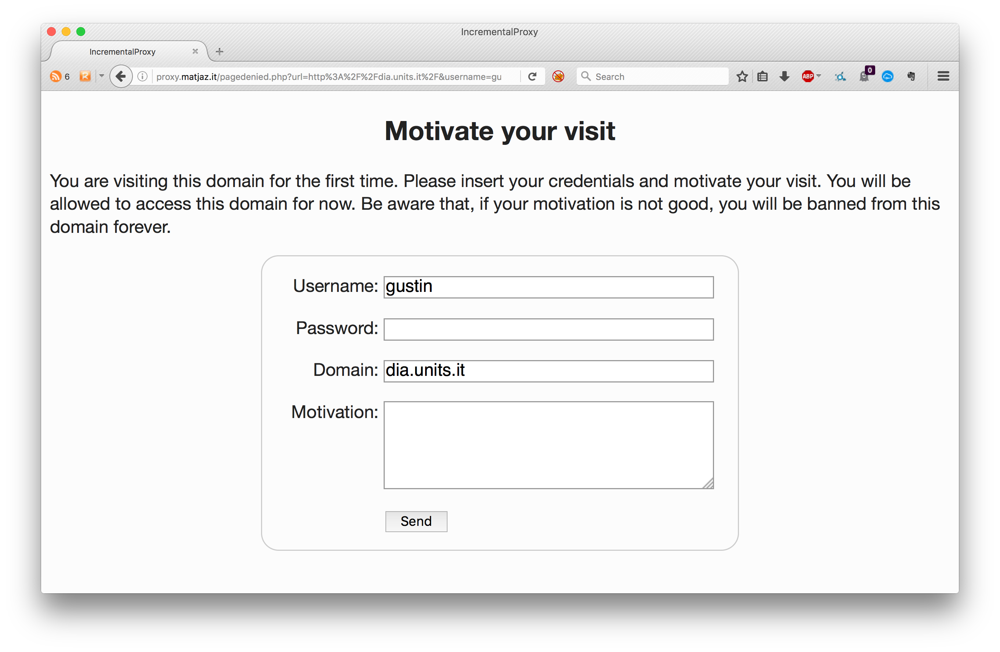
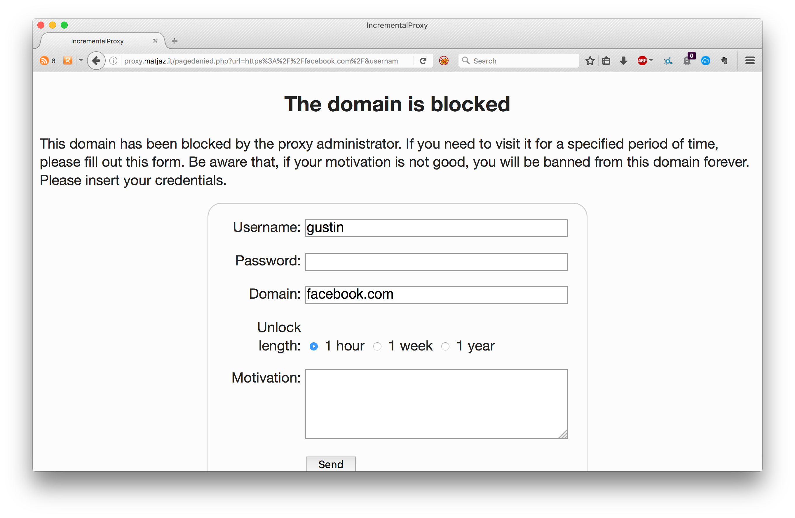
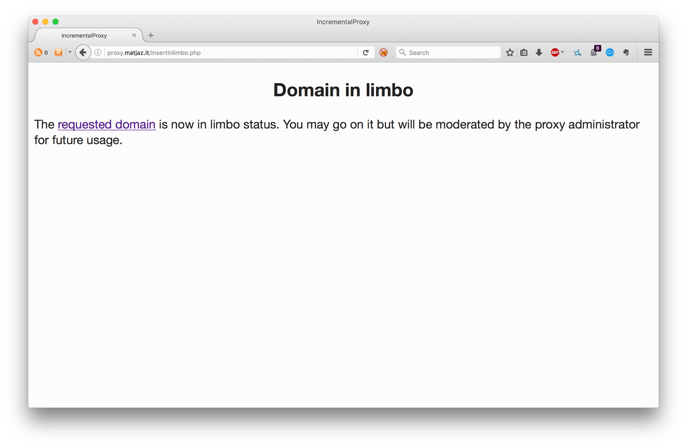
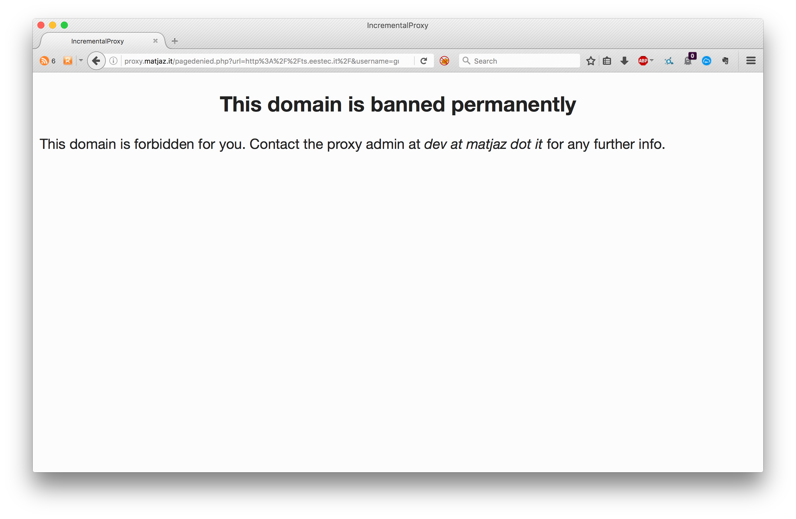
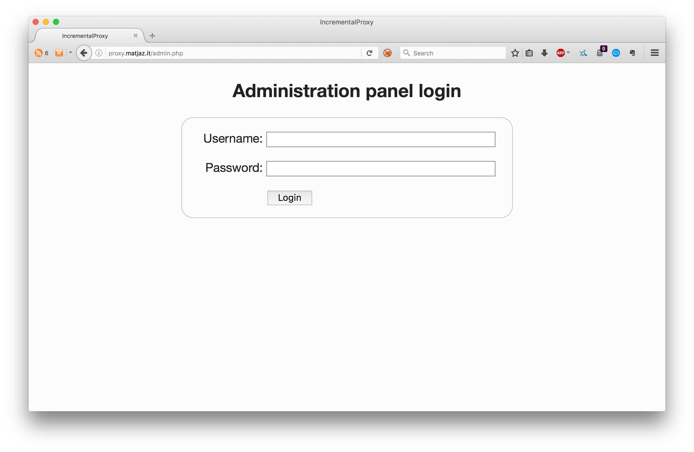
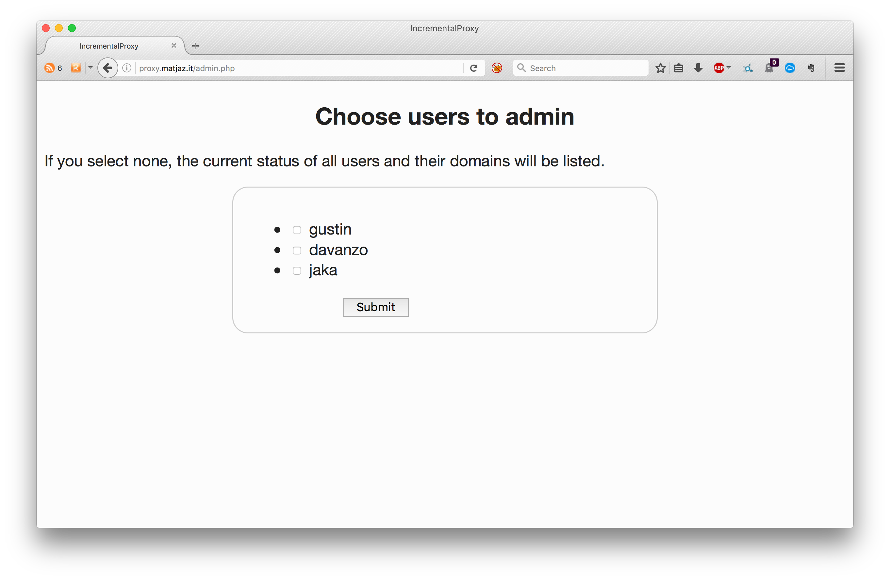
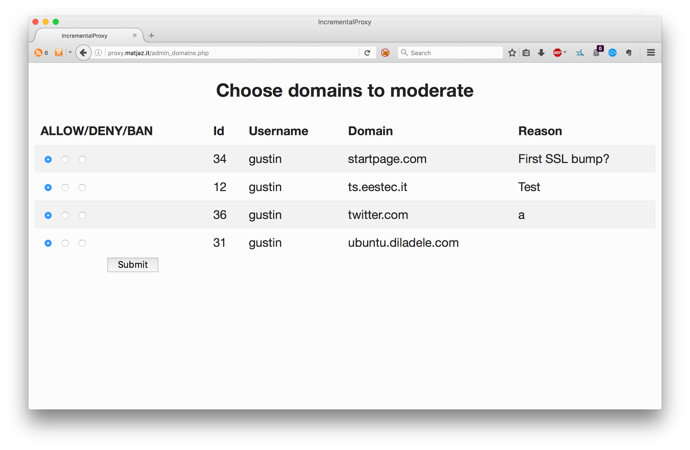
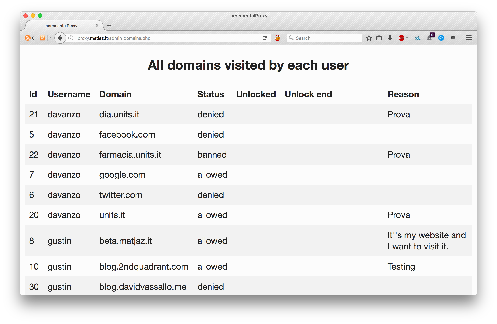

IncrementalProxy
================

IncrementalProxy is a database-driven external Access Control List for
Squid 3.5.x. It offers dynamic per-user restrictions of domains with temporary
unlock of domains and gives more power to the users: they can unlock themselves
the domains they want to visit - if they have a good reason for it.


Disclaimer - **abandoned project**
----------------------------------

This was an academic project. It's just a proof-of-concept without
automatic tests and **definitely not production ready**. Web development is
not my area of expertise.

I don't plan to update this project.
You are free to take this as a reference design and reimplement it in
a better, more reliable, properly tested way, maybe with a more modern
backend framework.


How it works
------------

Usually a proxy system has some domains blocked for certain IP addresses,
subnets or simply globally for all the users. This setting is written in a text
files statically. The file has to be modified manually by the proxy admin and 
the configuration of the proxy reloaded ad each change to make it effective. 
This situation is really painful when a user has to access a blocked website 
with a good reason for doing it (e.g. access Facebook because the Facebook page
of a company has to be updated), especially because the proxy admin may need a 
lot of time to answer the e-mail requesting the unlock.

IncrementalProxy solves this problem blocking domains on a per-user
specification (e.g. the PR department can access social media to represent the
company online, the manufacturing deparment can not) and users may activate an
unlock of any unknown domain (blocked by default in allow-list style) by 
writing
a motivational paragraph for their request on a web panel.



Some domains may be pre-denied, like social media, so the user needs to
motivate the visit anyway:



Upon request the domain is "in limbo", thus unlocked for the specified period 
of time automatically.



Periodically
the proxy admin will check the request list and permanently ban domains with 
unserious requests for that particular user.



Any resourse of any web page, like images, CSS, Javascript and so on is 
automatically allowed without requesting the user anything.

IncrementalProxy (as of now) performs the decryption of any HTTPS traffic to 
be able to filter it.


Domain statuses
---------------

Each domain is stored with a status for the current proxy user:

- **allowed**: the user may visit the domain;
- **denied**: the domain is blocked but many be temporary unlocked upon
  request. After the expiration fo the unlock, returns to this status;
- **banned**: the domain is permanently blocked and can not be unlocked via
  authomatic requests;
- **limbo**: the domain is visited for the first time and the user may proceed
  given that he/she writes the reason of the visit. This status is functionally
  the same as _allowed_ but works as flag to the proxy admin to check it and 
  moderate it to another status.


Web panel
---------

The web panel for users of the proxy offers a form to set a domain into limbo 
and a form to temporary unlock a domain. After the unlock the user is 
automatically redirected to the desired URL.

The web panel for administrators of the proxy offers a form where it's possible
to moderate any domain in status limbo and list all domains visited by all 
users.










Contact
-------

For **anything** feel free to contact me on <dev@matjaz.it>


Setup
-----

IncrementalProxy only works with Squid 3.5.x, previous versions do not have
the necessary features.

### System setup

This tutorial is based on Ubuntu Server 14.04, please take the necessary steps
to adapt it to your operative system.

```bash
# Update the whole system
sudo apt-get update
sudo apt-get upgrade

# Install the PostgreSQL RDMBS
sudo apt-get install postgresql

# Install some other requirements for IncrementalProxy to work
# Psycopg2 is the PostgreSQL dirver for the helper script which is in Python
# The libdbd-pg-perl is the same for Perl, which is used in the basic 
# authentication helper script provided with Squid.
sudo apt-get install python3-psycopg2 libdbd-pg-perl

# Setup the database by running the following commands
# Please change `db_admin` with your PostgreSQL superuser. The default one
# is `postgres`
psql -U db_admin -d postgres -f 01_postgresql_setup.sql
psql -U db_admin -d squid -f 02_postgresql_setup.sql
psql -U db_admin -d squid -f 03_postgresql_setup.sql

# Change the following line in the PostgreSQL configuration file
# (found at /etc/postgresql/9.5/pg_hba.conf or equivalent for your version)
#
# BEFORE:
#   local   all             all                                     peer
# AFTER: change `peer` into `md5`
#   local   all             all                                     md5
# This allows localhost connections with password-based authentication


# Clone this Git repository. Currently it is setup to be in a subfolder of the 
# home of the user `ubuntu`. If you change that, be aware that you must change
# the Squid configuration file as well.
mkdir /home/ubuntu/Development/IncrementalProxy
cd /home/ubuntu/Development/IncrementalProxy
git clone https://github.com/TheMatjaz/IncrementalProxy .

# Setup Apache, PHP and the PostgreSQL driver for PHP
sudo apt-get install apache2 php php-pgsql

# Follow this tutorial for more information about Apache and its virtual hosts
# https://www.digitalocean.com/community/tutorials/how-to-set-up-apache-virtual-hosts-on-ubuntu-14-04-lts

# Enable the PostgreSQL driver for PHP
sudo phpenmod pgsql
# and in the php.ini file add this line
extension=pgsql.so

# Hard link (or copy) the web pages directory's content in the Apache public
# www folder. Remember to set the Squid `deny_info` option to redirect the 
# user to your machine's domain name.
sudo ln /home/ubuntu/Development/IncrementalProxy/webpages/* /var/www/your.domain.name.com/public_html/

# Install Squid 3.5
# It is not available from the Canonical repository so you have to set up
# from the repository on ubuntu.diladele.com
sudo echo "deb http://ubuntu.diladele.com/ubuntu/ trusty main" > /etc/apt/sources.list.d/ubuntu.diladele.com.list
sudo apt-get update
sudo apt-get install libecap3 squid=3.5.19-1

# Create a symbolic link from the Squid configuration file to the one from
# this repository
sudo rm /etc/squid3/squid.conf
sudo ln -s /home/mat/Development/IncrementalProxy /etc/squid3/squid.conf

# Generate the self-signed keypair for HTTPS decryption (SSL bump)
openssl req -newkey rsa:4096 -sha256 -x509 -keyout /home/ubuntu/Development/IncrementalProxy/ssl_cert/squid.privatekey -out /home/ubuntu/Development/IncrementalProxy/ssl_cert/squid.pem -days 365 -nodes

# Fix the permissions of the certificate
sudo chown proxy:proxy /home/ubuntu/Development/IncrementalProxy/ssl_cert/*
sudo chmod 400 /home/ubuntu/Development/IncrementalProxy/ssl_cert/*

# Copy it into the in the Apache public www folder. Fix the command accordingly
# to your machine's domain name.
sudo cp /home/ubuntu/Development/IncrementalProxy/ssl_cert/squid.pem /var/www/your.domain.name.com/public_html/

# Reload Squid's configuration
sudo squid -k reconfigure
# Also Apache, just to be sure
sudo service apache2 restart

# Test redirection with wget
wget --delete-after -e use_proxy=yes -e http_proxy=localhost:8080 --proxy-user=someusername --proxy-password=somepassword someurltotest.com

# Rembember to open the port 8080 in the firewall!

```
